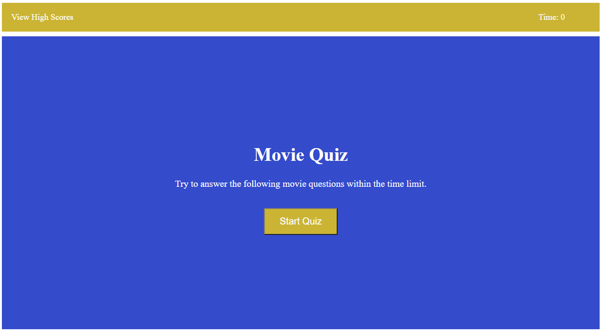

# Movie Quiz

## Description

This project was built with the goal of creating a timed coding quiz with multiple-choice questions. It runs in the browser and features dynamically updated HTML and CSS powered by JavaScript. It has a clean, polished, and responsive user interface.

## Table of Contents

- [Technologies](#technologies)
- [Preview](#preview)
- [Launch](#launch)

## Usage

Great for movie lovers who want to test their knowledge. 

## Technologies

- HTML
- CSS
- JavaScript

## Preview

## Launch

[Github Pages](https://negronmarc.github.io/Multiple-Choice-Quiz/)
